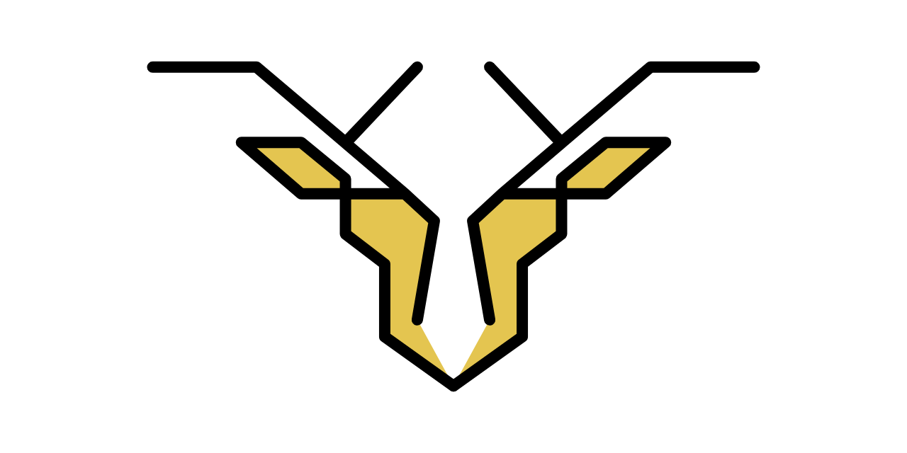

<div align="center">

# stag



**a modern and minimalist CSS framework.**


[](https://github.com/songmawa/stag/issues)
[](https://github.com/songmawa/stag/blob/master/LICENSE)

</div>

## Getting Started

### Dependancies

- [nodejs](https://nodejs.org/) >= 12.18.4
- [yarn](https://classic.yarnpkg.com/) >= 1.22.10

### Usage

#### CDN
```html
<link rel="stylesheet" href="https://unpkg.com/stagcss"/>
```

#### npm
```sh
npm install --save stagcss
```
#### yarn
```sh
yarn add stagcss
```

___

### Theming

#### 1. Copy `stag.scss` and rename it.
```sh
cp src/stag.scss src/stag-{theme}.scss
```

#### 2. Edit the color variables at the top of the page.
```scss
$color-primary:		config.$color-black !default;
$color-secondary: 	config.$color-grey-light !default;
$color-tertiary: 	config.$color-white !default;
$color-background: 	config.$color-white !default;
$color-accent-1: 	config.$color-gold-dark !default;
$color-accent-2: 	config.$color-magenta !default;
```

#### 3. Run `yarn build` to build the source.
```sh
yarn build
# or
yarn build --theme {theme}
# or
yarn build --theme {theme} --minify
```

### Building

Specify theme by using or ommiting `--theme` (`default` and `dark`). Minify using `--minify`.

#### Using gulp
```sh
yarn build
# or
gulp build
```

### Testing

#### Using jest
```sh
yarn test
# or
jest
```

## Documentation

Specifications & design documents can be found in the [wiki](/wiki).

## See Also

- **react-stag - https://github.com/songmawa/react-stag**
- **react-native-stag - [soon™]()**

## Contributing

Please see [CONTRIBUTING.md](CONTRIBUTING.md) for a in depth view.

## Credits

Please see [CREDITS.md](CREDITS.md) for a in depth view.

## License

This project is licensed under the **GPL-3.0** License - see the [LICENSE](LICENSE) file for details.
