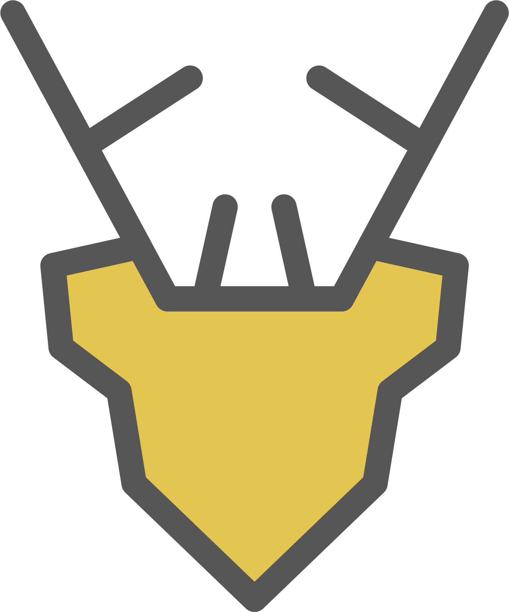

<div align="center">

# stag



**modern and minimalist CSS framework.**


[](https://github.com/songmawa/stag/issues)
[](https://github.com/songmawa/stag/pulls)
[](https://github.com/songmawa/stag/blob/master/LICENSE)

</div>

## Getting Started

### Dependancies

- [nodejs](https://nodejs.org/) >= 12.18.4
- [yarn](https://classic.yarnpkg.com/) >= 1.22.10

### Usage

#### CDN
```html
<link rel="stylesheet" href="https://unpkg.com/stagcss"/>
```

#### Bower
```sh
bower install stagcss
```

#### npm
```sh
npm install --save stagcss
```
#### yarn
```sh
yarn add stagcss
```

___

### Theming

#### 1. TODO
```sh
# TODO
```

### Building

#### Using gulp
```sh
yarn build
# or
gulp build
```

### Testing

#### Using jest
```sh
yarn test
# or
jest
```

## Documentation

Specifications & design documents can be found in the [wiki](/wiki).

## See Also

- **react-stag - [soon™]()**
- **react-native-stag - [soon™]()**

## Contributing

Please see [CONTRIBUTING.md](CONTRIBUTING.md) for a in depth view.

## Credits

Please see [CREDITS.md](CREDITS.md) for a in depth view.

## License

This project is licensed under the **GPL-3.0** License - see the [LICENSE](LICENSE) file for details.
